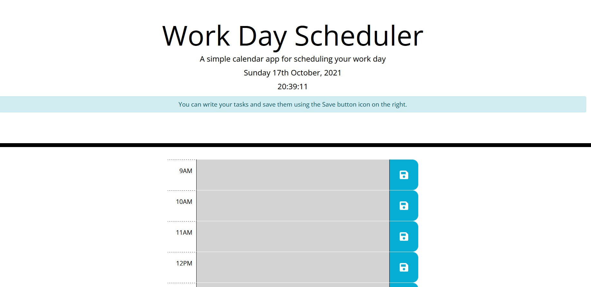

# work-day-scheduler

## PROJECT COMPLETE

LINK: [click here](https://akeneagle.github.io/work-day-scheduler/index.html)

## DESCRIPTION

With this application you can plan your day on a hourly basis from 9AM to 5PM. It saves your data so whenever you come back you have your tasks loaded.

## FEATURES

- Displays today's date and current time
- Gives you instructions if you access the page for the first time / delete all entries
- Save your entries with the save button
- Entries are loaded every time you come back on the page
- Works on desktop and mobile

## TECHNOLOGY USED

- Visual Studio Code
- HTML, CSS, JavaScript languages
- Moment API
- jQuery API
- Bootstrap CSS Library

## PREVIEW

